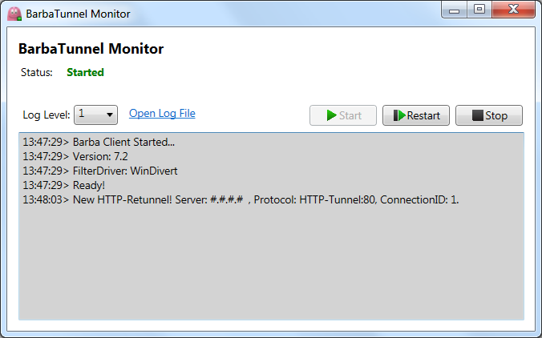
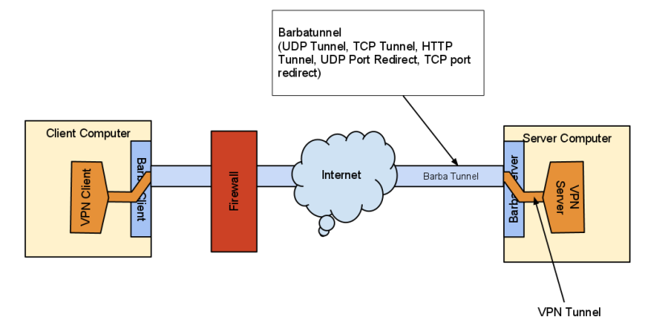

[Quick Start](https://github.com/BarbaTunnelCoder/BarbaTunnel/wiki/Quick-Start) | [Download](https://github.com/BarbaTunnelCoder/BarbaTunnel/releases) | [[Version History]]

**Project Description**
A layer that hide, redirect. forward, re-encrypt internet packet to keep VPN, Proxies and other p2p software hidden from Firewall. Free implementation for HTTP-Tunnel, UDP-Tunnel, port forwarding, port redirecting and packet re-encryption that can work in network data-link layer and transport layer.

# What is BarbaTunnel?
BarbaTunnel is software that helps you to bypass firewall and internet censorship, it is a Peer to Peer tunnel so you need a server outside of firewall network. In most case you can simply use **VPN** or any proxies but when you use VPN, firewall knows that you use a VPN, it does not know what you do, VPN and some other proxies does not hide their fingerprint. BarbaTunnel is a layer on your network and try to make existing VPN packets look at traditional packets. Actually BarbaTunnel does not work alone and it work with VPN. So if you have VPN and you don't have any issue with it, you do not need BarbaTunnel, but if the firewall blocks your VPN connection or your VPN connection speed decreased by firewall, BarbaTunnel may helpful for you.

**Attention:** _BarbaTunnel is not standalone tunnel and you should run a tunnel application or use a standard VPN connection after running BarbaTunnel._

# How to use BarbaTunnel?
Please read [Quick Start](https://github.com/BarbaTunnelCoder/BarbaTunnel/wiki/Quick-Start) in the documentation.

# Benefits
There are many proxies and VPN such as OpenVPN, PPTP, SSTP exists on the internet, BarbaTunnel make all of them work whenever a firewall block them. You don't need to change or create another VPN and proxies, let they do their work and let BarbaTunnel hide them on the network!

# Other Usages
UDP Port Forwarding and TCP Port forwarding may be used for other purpose. You can also tunnel any desired port or protocol without installing an internet tunnel. for example you can tunnel RDP to HTTP-Tunnel on port 80.

# Features
* Easy to use
* MIT License
* Work in Data-Link Layer and Transport Layer
* Support all applications and all protocols without the need of sock proxy
* 100% transparent to all applications without need any configuration or setting proxy.
* HTTP Tunnel
* TCP Tunnel
* UDP Tunnel
* UDP Port Redirect and Encryption
* TCP Port Redirect and Encryption
* Full-NAT Support
* Does not bypass Local System Firewall and Parental Control
* Many Client can connect to many servers at the same time
* Can run as a Service
* Notification Icon

# How Barbatunnel work?

# Barbatunnel Diagram

# Current Implementation
* HTTP-Tunnel
* TCP-Tunnel
* UDP-Tunnel
* UDP-Redirect
* TCP-Redirect

# Tested Platform
To see what system we actually tested please click on [docs/Tested Platforms](Tested-Platforms).

# Requirements
* VPN or any other proxy software
* Windows Vista, Windows 7, Windows 8, Server 2008, Server 2012. (All x86/x64).
* Windows XP or Server 2003 (Need WinpkFilter driver)
* .NET Framework 4.5 (Optional to run BarbaMonitor or run BarbaTunnel as a service)

# Special Thanks
BarbaTunnel use one of the following network filter driver. The default filter driver is WinDivert.
* [WinDivert](http://reqrypt.org/divert.html), WinDivert is a free open source (LPGL) software package that provides user-mode packet capture, redirection, modification, and re-injection for Windows Vista/Windows 7/Windows 8/2008/2008R2. (LPGL License).
* [WinpkFilter](http://www.ntkernel.com/?Products:Development_Toolkits:Windows_Packet_Filter_Kit), high performance packet filtering framework for Windows 9x/ME/NT/2000/XP/2003/Vista/2008/Windows 7/Windows 8/2008R2/2012 that allows developers to transparently filter (view and modify) raw network packets with minimal impact on network activity without having to write low level TDI or NDIS driver code. (Commercial License).
