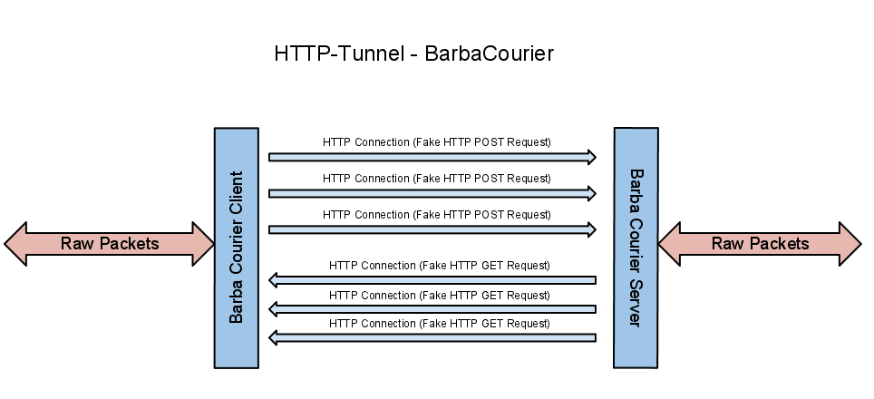

# HTTP-Tunnel
This document is some information of HTTP-Tunnel design and architecture in BarbaTunnel.

## Goal
Bypass firewall by creating fast, reliable and consistence tunnel via POST and GET concurrent requests same as what standard HTTP browser do. Firewall or any man in the middle will just see that user downloading some binary file such as image or zip. HTTP-Connections does not need to stay open, they will close after specific time or transfer. The serious closing and opening HTTP connection will not interrupt the actual tunnel connection.
 
## Features
* Firewall just see user download or upload some files.
* If a HTTP-connection failed or closed suddenly there is some ready HTTP connection so the actual tunnel connection will not be interrupted.
* TCP packet require acknowledgement that not needed for HTTP-Tunnel, in this case when a socket wait for acknowledgement, BarbaCourier send packet via another open connections. actually Barba socket acknowledgement not needed, because if a packet lost, the VPN server or original TCP connection will send that packet again.
* Users can change the fake requests in template files.

## Barba Courier
Barba Courier send packet to other peer via concurrent standard HTTP browser connection.

### Involved Class
BarbaCourier, BarbaCourierServer, BarbaCourierClient

### Tasks
* It is the core of Barba HTTP-tunnel and responsible to deliver packets via standard HTTP connection to other peer.
* Establish some non permanent tcp-connection for download a file (GET Request).
* Establish some non permanent tcp-connection for upload a file (POST Request).
* It care that there is always some ready connection exists as backup before all connection closed.
* It may drop its tcp-connections itself depending of transfer or time of each tcp connection.
* It will establish new connection when detect some tcp-connection not worked properly or dropped.
* It may send packet via any of its outgoing tcp-connection or receive from any its incoming connection.

## HTTP-Tunnel Client
### Involved Class
BarbaClientHttpCourier, BarbaClientHttpConnection, BarbaClientSocket

### Procedure
# BarbaClient create a BarbaClientHttpConnection.
# BarbaClientHttpConnection create an BarbaClientCourier.
# BarbaClientCourier initial the BarbaClientSocket for incoming and outgoing then send fake request to server with its tunnel connection id.
# BarbaClientHttpConnection Process packets via BarbaClientCourier.

## HTTP-Tunnel Server
### Involved Class
BarbaServerHttpHost, BarbaServerHttpCourier, BarbaServerHttpConnection, BarbaServerSocket

### Procedure
# BarbaServer create BarbaServerHttpHost.
# BarbaServerHttpHost listen to incoming TCP ports for Http Tunnel.
# For each incoming tcp socket, BarbaServerHttpHost wait for HTTP request and extract tunnel connection id from it.
# If incoming BarbaConnection id was new, BarbaServerHttpHost create new BarbaServerHttpConnection and add the new socket to its BarbaServerHttpCourier.
# If incoming session already exists BarbaServerHttpHost will add the socket to its BarbaServerHttpCourier.
# BarbaServerHttpConnection Process packets via BarbaServerHttpCourier.
